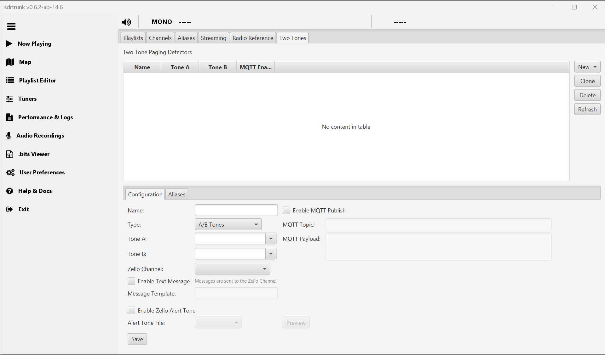
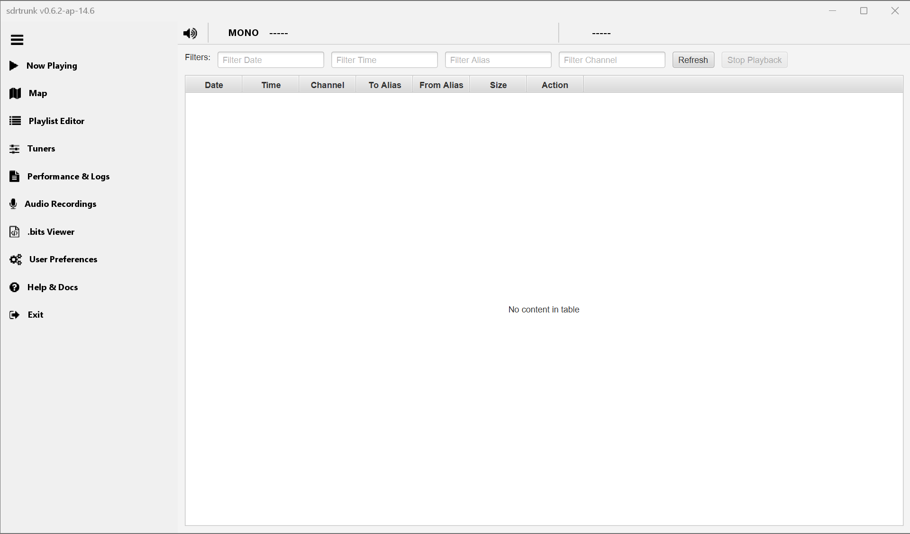

<h1>sdrtrunk - Kennebec Version</h1>

Welcome to the Kennebec version of sdrtrunk—a modernized, cross-platform Java application engineered for decoding, monitoring, recording, and streaming trunked mobile and related radio protocols using Software Defined Radios (SDR).

This repository is a fork of <a href="https://github.com/actionpagezello/sdrtrunk">https://github.com/actionpagezello/sdrtrunk</a>, which is itself a fork of the original SDRTrunk application (<a href="https://github.com/DSheirer/sdrtrunk">https://github.com/DSheirer/sdrtrunk</a>). The Kennebec version adds an extensive layer of new capabilities on top of the features introduced by the actionpagezello fork.

This version is explicitly designed for listening to public safety and other radio frequencies and streaming audio to various internet streaming services. It takes the robust decoding engine of sdrtrunk and pairs it with a highly refined, context-aware user experience.

Prerelease Notice: The current version is a prerelease pending the completion of unit and system testing.

<h2>What is SDRTrunk?</h2>

SDRTrunk is a Java-based application that transforms a standard computer and compatible Software Defined Radio hardware, such as RTL-SDR, Airspy, or HackRF, into a powerful, multi-channel radio scanner. Unlike traditional hardware scanners that can only listen to one frequency at a time, SDRTrunk captures a wide swath of the radio spectrum simultaneously.

This wideband capture allows the software to monitor entire trunked radio systems, where conversations dynamically jump across multiple frequencies. SDRTrunk automatically tracks system control channels, decodes the digital or analog voice traffic, and pieces the conversations back together in real time. It supports a variety of common public safety and commercial radio protocols, including Project 25 (P25) Phase 1 and 2, DMR, LTR, and standard analog FM. By utilizing software-based digital signal processing, it provides an accessible and highly configurable way to monitor local radio traffic, manage talkgroups, and route the resulting audio to external internet streaming platforms.

<h2>Why the Kennebec Version?</h2>
<ul>
  <li>Streamlined Monitoring: Focused on optimizing the flow of mission-critical audio and data to internet streaming platforms.</li>
  <li>Modern Efficiency: Built to reduce cognitive load on operators with deeply integrated contextual help, streamlined configuration, and a modernized interface.</li>
  <li>In-App Knowledge Base: Say goodbye to alt-tabbing to a wiki. An embedded, searchable technical documentation viewer brings the knowledge you need right to your fingertips.</li>
  <li>Deep OS Integration: Utilizing modern Java and JNA for advanced desktop integration (e.g., native backdrops and theme syncing).</li>
</ul>

<h2>Features</h2>
<ul>
  <li>Comprehensive digital and analog trunking support (P25, DMR, etc.).</li>
  <li>Automated audio recording, streaming, and metadata tagging.</li>
  <li>Contextual DSP explanations and interactive configuration.</li>
  <li>Fully searchable in-app Help Viewer.</li>
  <li>Two Tone Detect functionality.</li>
  <li>Refreshed Ux/GUI with new icons.</li>
  <li>New Ux/GUI for reviewing logs and recorded audio files.</li>
  <li>Consolidated all settings into a single user preference area.</li>
  <li>SDR Tuner width auto calculating.</li>
  <li>New stream type for IamResponding (local computer only via UDP) using two tone detect.</li>
  <li>Optional Gemini AI integration: When enabled, AI can auto set channel filters, review logs, monitor application performance, monitor channel audio quality, and notify the user if the audio is not understandable.</li>
  <li>Configurable Error Notifications: Option to configure system notifications via Telegram or Email when application or tuner errors occur.</li>
  <li>Inactivity Monitoring: Monitor channels for no activity. User-configurable to send alerts via Telegram or Email if a channel remains silent for a set duration.</li>
  <li>Tuner Self-Healing: Application includes advanced logic to automatically attempt self-healing on tuners that encounter an error.</li>
  <li>Automated Tuner Reset (Windows 10+): When running on Windows 10 or higher, the application executes PowerShell scripts to attempt to hard-reset SDR tuners directly within the Windows OS if they become locked or fail.</li>
  <li>Ability to set allocated memory directly via the user preferences Ux/GUI.</li>
</ul>

<h2>Screenshots</h2>

Refreshed GUI (Now Playing) 

  

In-App Knowledge Base &amp; Help Viewer 

  

Two Tone Detect Functionality 

  

Audio Recordings Review 

  

Consolidated User Preferences 

<h2>Minimum System Requirements</h2>
<ul>
  <li>Operating System: Windows (64-bit), Linux (64-bit) or Mac (64-bit, 12.x or higher)</li>
  <li>CPU: 4-core</li>
  <li>RAM: 8GB or more (preferred). Depending on usage, 4GB may be sufficient.</li>
  <li>Java: Requires Java 23+ (automatically provisioned via Gradle Toolchains).</li>
</ul>
